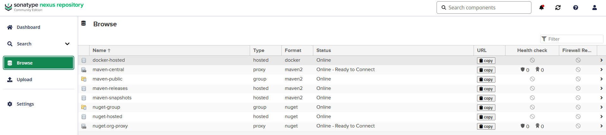
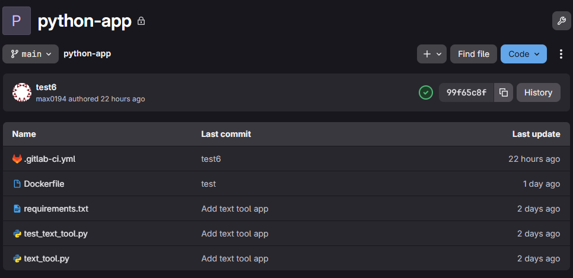
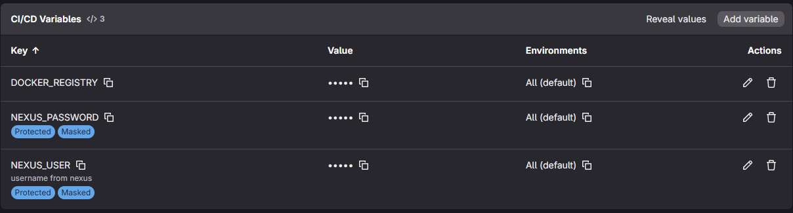
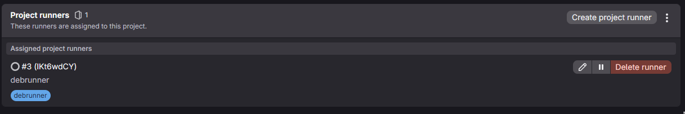
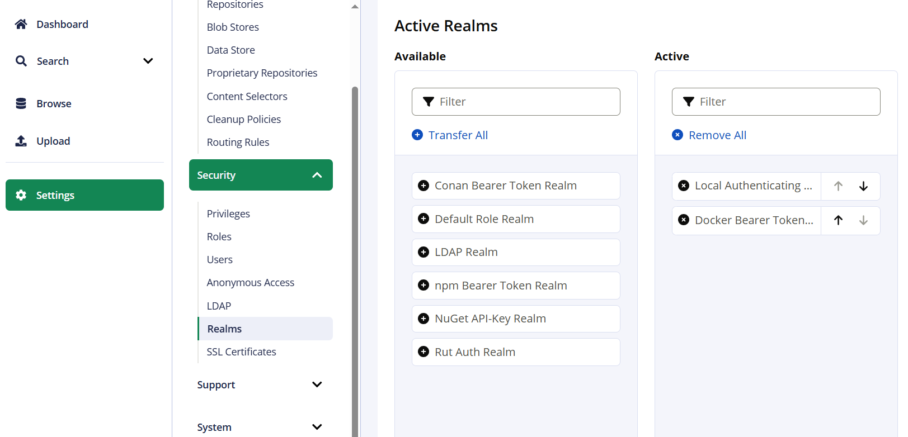
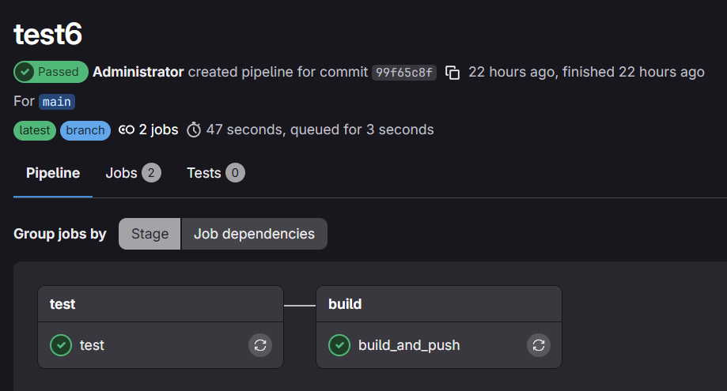
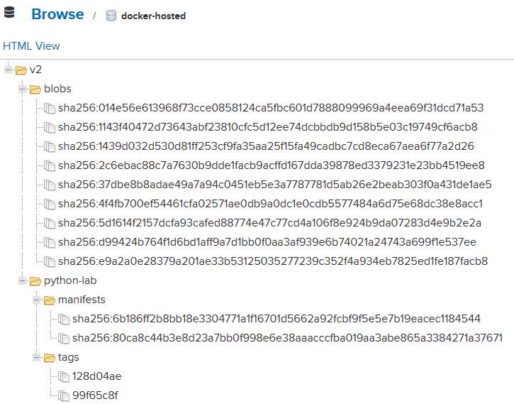

## Информационные технологии: лабораторная работа №4 (Gitlab, Nexus3 и Docker Compose)

### Выполнил: студент группы ИС-23 Долгополов Максим

---

Использованные машины:
1. Хост - WSL Ubuntu
2. Гость (Runner) - Oracle VM VirtualBox Debian-12.12

Использованные образы (хост):
1. Nexus3:latest
2. Gitlab:ce-latest

Использованные образы (гость(Runner)):
1. Docker:24.0
2. Docker:24.0-dind
3. python:3.12-alpine

---

### Задание 1.

Для запуска многоконтейнерного приложения с GitLab и Nexus3 создаем файл compose.yaml:

<details>
<summary><strong>compose.yaml</strong></summary>

~~~
services:
  gitlab:
    image: gitlab/gitlab-ce:latest
    container_name: gitlab
    restart: always
    hostname: 'gitlab.local'
    environment:
      GITLAB_OMNIBUS_CONFIG: |
        external_url 'http://gitlab.local:8081'
        gitlab_rails['gitlab_shell_ssh_port'] = 2424
    ports:
      - '8081:8081'
      - '2424:22'
    volumes:
      - gitlab_config:/etc/gitlab
      - gitlab_logs:/var/log/gitlab
      - gitlab_data:/var/opt/gitlab
    networks:
      - devops-net
  nexus:
    image: sonatype/nexus3:latest
    container_name: nexus
    hostname: 'nexus.local'
    ports:
      - '8082:8081'
      - '8083:8083'
      - '5000:5000'
    restart: always
    volumes:
      - './nexus_data:/nexus-data'
    networks:
      - devops-net

volumes:
  gitlab_config:
  gitlab_logs:
  gitlab_data:

networks:
  devops-net:
    driver: bridge
~~~

</details>

В файл по пути C:/Windows/System32/drivers/etc/hosts вводим новые домены для локальной сети 127.0.0.1 (nexus.local и gitlab.local).
После запуска (docker compose up -d) и ~10 минут ожидания страницы сервисов открываются:




Для входов использовались профили root (в Gitlab) и admin (в Nexus). Пароли для них хранятся внутри самих контейнеров и их можно просмотреть через ```docker exec -it "имя контейнера" cat ```. Пароль для Gitlab находится в контейнере по пути: /etc/gitlab/initial_root_password, а пароль для Nexus - /nexus-data/admin.password

---

### Задание 2.

Создаем простое приложение на языке Python, состоящее из двух скриптов и документа для скачивания библиотеки:

<details>
<summary><strong>Код скрипта text_tool.py</strong></summary>

~~~
def count_words(text):
    """Подсчитывает количество слов в тексте."""
    return len(text.split())

def longest_word(text):
    """Находит самое длинное слово в тексте."""
    words = text.split()
    return max(words, key=len) if words else None
~~~

</details>

---

<details>
<summary><strong>Код скрипта test_text_tool.py</strong></summary>

~~~
import pytest
from text_tool import count_words, longest_word

def test_count_words():
    assert count_words("Hello world") == 2
    assert count_words("") == 0

def test_longest_word():
    assert longest_word("Hello world") == "Hello"
    assert longest_word("") is None
~~~

</details>

---

<details>
<summary><strong>Библиотека в requirements.txt</strong></summary>

~~~
pytest
~~~

</details>

Вид репозитория в GitLab:



В интерфейсе GitLab и настройках CI/CD вводим параметры Variables и создаем Runner:





Не забываем указать внешний порт контейнера 8083 в HTTP-Connector в docker-hosted в Nexus3:


А также подключаем Docker Bearer Token Realm по пути Settings -> Security -> Realms:



---

### Задание 3.
Аналогично Windows, в файл по пути etc/hosts вводим новые домены для сети хоста (nexus.local и gitlab.local). Адрес можно узнать через ipconfig в командной строке хоста.
На виртуальной машине Debian подключаем удаленный репозиторий по ссылке (git clone <*ссылка*>).
Создаем в репозитории и заполняем файл CI .gitlab-ci.yml:

<details>
<summary><strong>.gitlab-ci.yml</strong></summary>

~~~
stages:
  - test
  - build
variables:
  PIP_CACHE_DIR: "$CI_PROJECT_DIR/.cache/pip"
  DOCKER_IMAGE: "$DOCKER_REGISTRY/python-lab"
  DOCKER_REGISTRY: "nexus.local:8083"
  DOCKER_HOST: tcp://docker:2375
  DOCKER_TLS_CERTDIR: ""
test:
  stage: test
  image: python:3.12-alpine
  script:
    - pip install -r requirements.txt
    - pytest --junitxml=report.xml
  artifacts:
    paths:
      - report.xml
build_and_push:
  stage: build
  image: docker:24.0
  services:
    - name: docker:24.0-dind
      alias: docker
      command: ["--tls=false", "--insecure-registry=nexus.local:8083"]
  script:
    - docker version
    - docker login "$DOCKER_REGISTRY" -u "$NEXUS_USER" -p "$NEXUS_PASSWORD"
    - docker build -t "$DOCKER_IMAGE:$CI_COMMIT_SHORT_SHA" .
    - docker push "$DOCKER_IMAGE:$CI_COMMIT_SHORT_SHA"
  needs:
    - test
  only:
    - main
    - master
~~~

</details>

---

Для создания раннера необходимо выполнить следующие шаги:

1. Скачиваем библиотеку в папку bin:
sudo curl -L --output /usr/local/bin/gitlab-runner https://gitlab-runner-downloads.s3.amazonaws.com/latest/binaries/gitlab-runner-linux-amd64

2. Даем разрешение на запуск gitlab-runner:
sudo chmod +x /usr/local/bin/gitlab-runner

3. Создаем пользователя для запуска и работы gitlab-runner:
sudo useradd --comment 'GitLab Runner' --create-home gitlab-runner --shell /bin/bash

4. Устанавливаем gitlab-runner как сервис на пользователя gitlab-runner, затем запускаем:
sudo gitlab-runner install --user=gitlab-runner --working-directory=/home/gitlab-runner
sudo gitlab-runner start

5. Непосредственно соединяем gitlab-runner с gitlab репозиторием:
sudo gitlab-runner register

6. Задаются вопросы, самое главное: указываем токен, адрес репозитория на хосте и executor'а (исполнителя) как Docker.

Конфиг раннера по пути /etc/gitlab-runner/config.toml:

<details>
<summary><strong>.gitlab-ci.yml</strong></summary>

~~~
concurrent = 4
check_interval = 0
connection_max_age = "15m0s"
shutdown_timeout = 0

[session_server]
  session_timeout = 1800

[[runners]]
  name = "DebianRunner"
  url = "http://gitlab.local:8081"
  id = 3
  token = "token"
  token_obtained_at = 2025-12-10T12:24:24Z
  token_expires_at = 0001-01-01T00:00:00Z
  executor = "docker"
  [runners.cache]
    MaxUploadedArchiveSize = 0
    [runners.cache.s3]
    [runners.cache.gcs]
    [runners.cache.azure]
  [runners.docker]
    tls_verify = false
    image = "python:3.12-alpine"
    privileged = true
    disable_entrypoint_overwrite = false
    oom_kill_disable = false
    disable_cache = false
    volumes = ["/cache"]
    shm_size = 0
    network_mtu = 0
    run_untagged = true
    extra_hosts = ["gitlab.local:192.168.8.119", "nexus.local:192.168.8.119"]
    pull_policy = "if-not-present"
    wait_for_services_timeout = 30
~~~

</details>

---

Добавляем в Dockerfile инструкцию по созданию образа:

<details>
<summary><strong>Dockerfile</strong></summary>

~~~
FROM python:3.12-alpine
COPY text_tool.py /app/
WORKDIR /app
CMD ["python"]
~~~

</details>

После запуска получаем выполненные jobы:



Успешно загруженный образ в Nexus:



---

### Заключение

В ходе работы я научился настраивать полноценную локальную среду CI/CD с использованием GitLab и Nexus. Основные приобретенные навыки:

- Оркестрация сервисов: Запуск и связывание GitLab и Nexus через Docker Compose в единой сети с настройкой доменных имен.

- Настройка GitLab CI/CD: Создание пайплайна для автоматического тестирования Python-приложения и сборки Docker-образов.

- Работа с Runners: Регистрация и конфигурация GitLab Runner на отдельной виртуальной машине для выполнения задач CI/CD.

- Интеграция с Nexus: Настройка Nexus как приватного Docker-реестра, аутентификация в нём из пайплайна и успешная отправка туда собранных образов.

- Сетевые взаимодействия: Организация корректной связи между хост-машиной, виртуальной машиной с Runner и контейнерами сервисов через настройку hosts и extra_hosts.

В результате был успешно создан автоматизированный цикл: код приложения хранится в GitLab, при пуше в репозиторий автоматически запускаются тесты, а затем собирается и отправляется в приватный реестр Docker-образ. Это практический пример построения базового DevOps-конвейера.